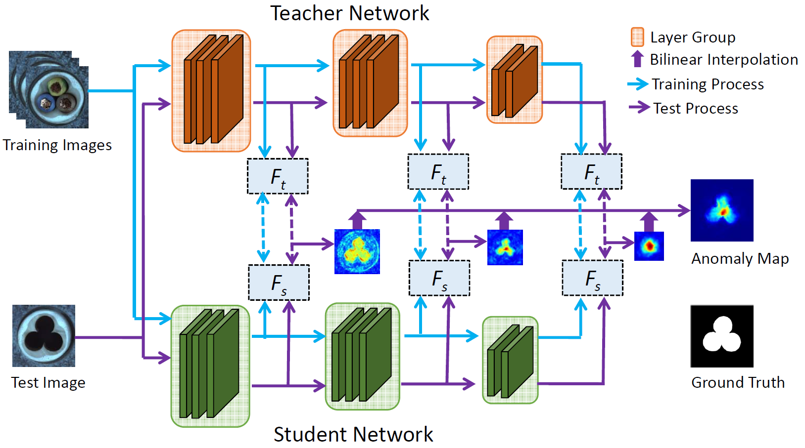
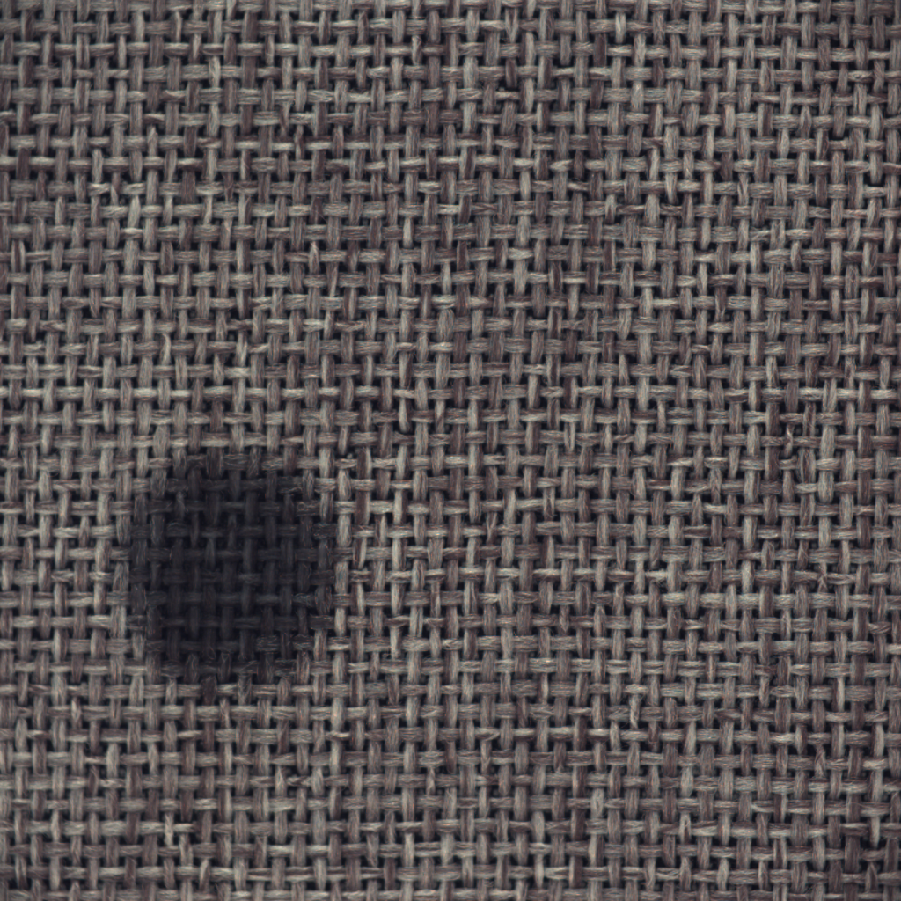
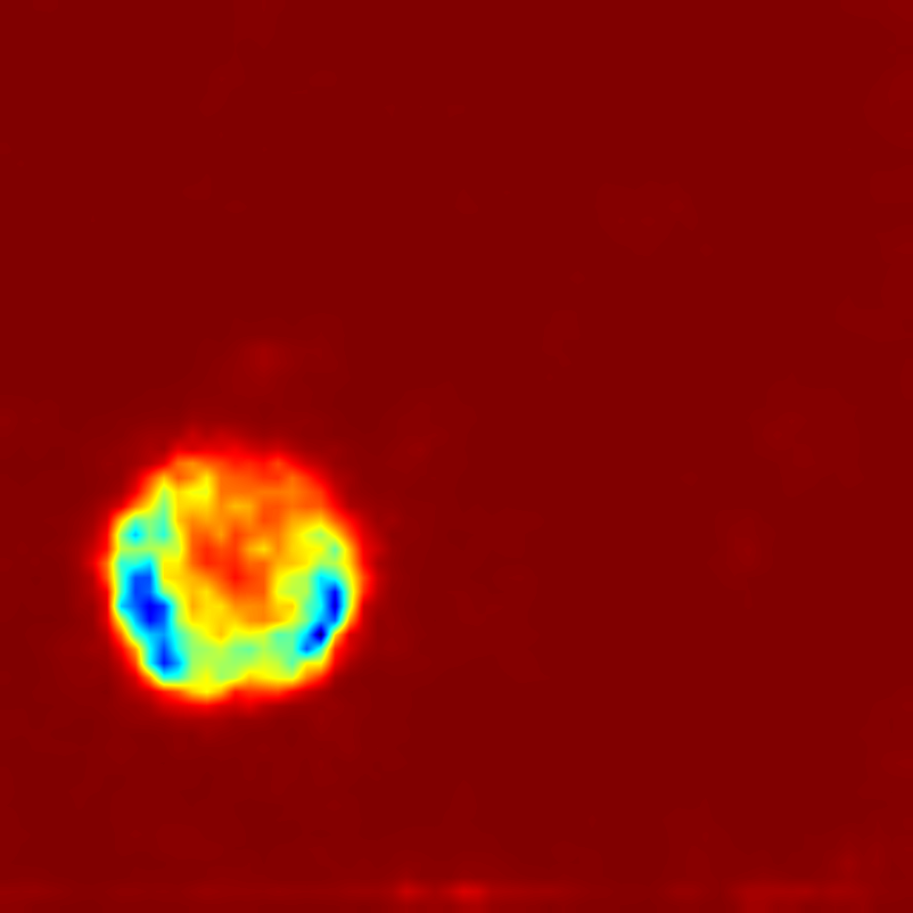
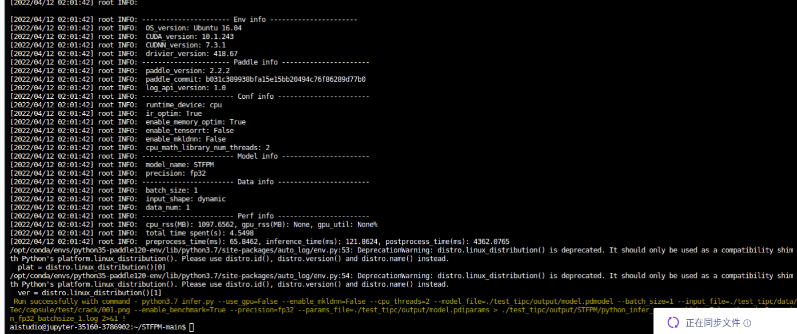

# STFPM-Paddle

## 1 简介
This is the unofficial code based on **PaddlePaddle** of BMVC 2021 paper:<br>
[Student-Teacher Feature Pyramid Matching for Anomaly Detection](https://arxiv.org/abs/2103.04257v3)



STFPM算法由预先培训的教师网络和结构相同的学生网络组成。学生网络通过将特征与教师网络中的对应特征相匹配来学习无异常图像的分布。多尺度特征匹配用于增强鲁棒性。这种分层特征匹配使学生网络能够从特征金字塔接收多层次知识的混合，从而允许各种大小的异常检测。
在推理过程中，比较了教师网络和学生网络的特征金字塔。差异越大，异常发生的概率越高。
本项目基于PaddlePaddle框架复现了STFPM，并在MvTec数据集上进行了实验。
**论文：**
- [1]  Wang, G.  and  Han, S.  and  Ding, E.  and  Huang, D. [Student-Teacher Feature Pyramid Matching for Anomaly Detection](https://arxiv.org/abs/2103.04257v3)
**项目参考：**
- [anomalib](https://github.com/openvinotoolkit/anomalib/tree/development/anomalib/models/stfpm)
- [STFPM](https://github.com/gdwang08/STFPM)

## 2 复现精度
>在MvTec数据集的测试效果如下表。


### Image-Level AUC

|                |  Avg  | Carpet | Grid  | Leather | Tile  | Wood  | Bottle | Cable | Capsule | Hazelnut | Metal Nut | Pill  | Screw | Toothbrush | Transistor | Zipper |
| -------------- | :---: | :----: | :---: | :-----: | :---: | :---: | :----: | :---: | :-----: | :------: | :-------: | :---: | :---: | :--------: | :--------: | :----: |
| anomalib | 0.893 | 0.954  | 0.982 |  0.989  | 0.949 | 0.961 | 0.979  | 0.838 |  0.759  |  0.999   |   0.956   | 0.705 | 0.835 |   0.997    |   0.853    | 0.645  |
| Paddle | 0.937 | 0.972  |  0.988 |  0.999  | 0.992 | 0.993 | 1.000  | 0.933 |  0.817  |  1.000   |   0.984   | 0.933 | 0.856 |    0.772     |   0.946    | 0.866  |

### Pixel-Level AUC

|                |  Avg  | Carpet | Grid  | Leather | Tile  | Wood  | Bottle | Cable | Capsule | Hazelnut | Metal Nut | Pill  | Screw | Toothbrush | Transistor | Zipper |
| -------------- | :---: | :----: | :---: | :-----: | :---: | :---: | :----: | :---: | :-----: | :------: | :-------: | :---: | :---: | :--------: | :--------: | :----: |
| anomalib | 0.951 | 0.986  | 0.988 |  0.991  | 0.946 | 0.949 | 0.971  | 0.898 |  0.962  |  0.981   |   0.942   | 0.878 | 0.983 |   0.983    |   0.838    | 0.972  |
| Paddle | 0.967 | 0.992  | 0.988 |  0.994  | 0.959 | 0.954 | 0.988  | 0.954 |  0.979  |  0.987   |   0.974   | 0.970 | 0.982 |   0.989    |   0.817    | 0.982  |

image-level auc的Mean为0.937。 pixel-level auc的Mean为0.967。

达到验收指标。

训练日志：[logs](logs/)
AIStudio预训练权重和日志：[AIStudio预训练权重](https://aistudio.baidu.com/aistudio/datasetdetail/138329)

## 3 数据集
数据集网站：[MvTec数据集](https://www.mvtec.com/company/research/datasets/mvtec-ad/)

AiStudio上的数据集：[MVTec-AD](https://aistudio.baidu.com/aistudio/datasetdetail/116034)

这里采用AiStudio上的数据集上的数据集，下载后用如下命令解压到自己指定的**PATH/MVTec路径**下：
```shell
tar xvf mvtec_anomaly_detection.tar.xz
```

## 4 环境依赖
- 硬件: Tesla V100 16G >= 1

- 框架:
    - PaddlePaddle >= 2.2.0
    
## 快速开始

### 第一步：克隆本项目
```bash
# clone this repo
git clone git@github.com:CuberrChen/STFPM-Paddle.git
cd STFPM-Paddle
```

### 第二步：训练模型
MVTec共有15个类别的子数据集，因此每个类别都需要单独训练一个模型；
在训练时，通过category参数来指定类别数据进行训练。depth表示resnet深度。mvtec_ad指定上述数据集路径**PATH/MVTec** 。
train_val表示是否在训练时开启指标计算。model_save_path指定模型保存路径，会在这个路径下生成category的目录。
seed表示随机数种子，这里根据给定参考项目取`42`.

开始训练：
以carpet为例：
```bash
python train.py train --depth=18 --mvtec_ad=PATH/MVTec --category carpet --epochs 100 --train_val=True --model_save_path=./output --seed 42
```

### 第三步：验证
需要指定训练好的模型参数路径`checkpoint=output/carpet/best.pdparams`
```bash
python val.py --depth=18 --mvtec_ad=PATH/MVTec --category carpet --checkpoint=output/carpet/best.pdparams
```

### 第四步：预测
这里需要指定单张图片路径image_path以及保存预测结果路径save_path，会在生成预测结果predict.png
```shell
python predict.py --checkpoint=output/carpet/best.pdparams --image_path=/home/aistudio/data/carpet/test/color/000.png --save_path=predict.png
```

原图：



检测结果：




### 第五步：TIPC

**详细日志在[test_tipc/output](test_tipc/output/STFPM)**

TIPC: [TIPC: test_tipc/README.md](test_tipc/README.md)

首先安装auto_log，需要进行安装，安装方式如下：
auto_log的详细介绍参考https://github.com/LDOUBLEV/AutoLog。
```shell
git clone https://github.com/LDOUBLEV/AutoLog
cd AutoLog/
pip3 install -r requirements.txt
python3 setup.py bdist_wheel
pip3 install ./dist/auto_log-1.2.0-py3-none-any.whl
```
进行TIPC：
```bash
bash test_tipc/prepare.sh test_tipc/configs/STFPM/train_infer_python.txt 'lite_train_lite_infer'

bash test_tipc/test_train_inference_python.sh test_tipc/configs/STFPM/train_infer_python.txt 'lite_train_lite_infer'
```
TIPC结果：

**tipc测试结果截图**




- 预训练模型的静态图导出与推理测试：

```shell
python export_model.py --depth 18 --img_size=256 --model_path=./output/carpet/best.pdparams --save_dir=./output
```

```shell
python infer.py --use_gpu=True --model_file=output/model.pdmodel --input_file=/home/aistudio/data/carpet/test/color/000.png --params_file=output/model.pdiparams
```

可正常导出与推理。

## 5 代码结构与说明
**代码结构**
```
├── data
├── datasets
├── models
├── logs
├── output
├── test_tpic
├── README.md
├── train.py
├── val.py   
├── predict.py
├── export_model.py
├── infer.py
└── requirements.txt              
```

## 6 模型信息

相关信息:

| 信息 | 描述 |
| --- | --- |
| 作者 | xbchen|
| 日期 | 2022年4月 |
| 框架版本 | PaddlePaddle==2.2.1 |
| 应用场景 | 异常检测 |
| 硬件支持 | GPU、CPU |
| 在线体验 | [notebook](https://aistudio.baidu.com/aistudio/projectdetail/3786902?contributionType=1)|

## 7 说明

- 感谢百度提供的算力支持。